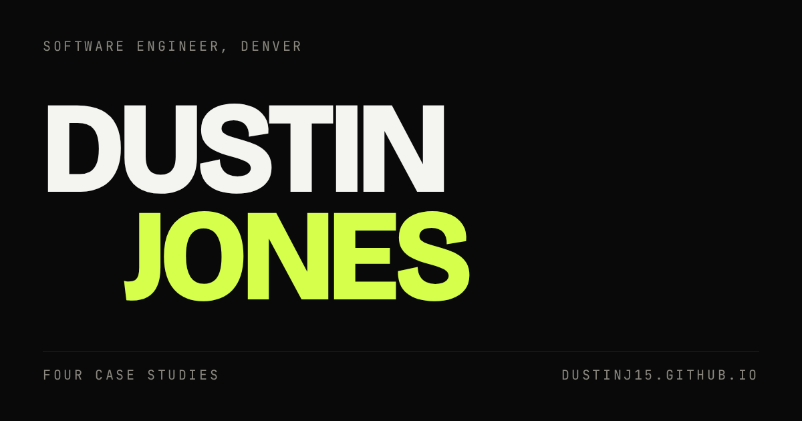

# dustinj15.github.io

The source for **[dustinj15.github.io](https://dustinj15.github.io)**, Dustin Jones's
portfolio. Four case studies: a quoting system, a label generator, a billing analyzer
and an ETL pipeline. Astro 7, Tailwind v4, TypeScript, no React, static output, deployed
to GitHub Pages on every push to `main`. Astro is the only runtime dependency, the
typefaces are self-hosted, and the built site makes no third-party requests.

The one file worth opening is [`scripts/verify.py`](scripts/verify.py), the gate every
change has to clear. What it checks is the next section.



## The gate

`npm run verify` is the one command that says whether the site is broken. It type-checks,
builds, serves `dist/` locally and drives all eight routes with Playwright at 375, 768
and 1440. It exits non-zero if any stage fails.

Per route, per viewport:

- **No horizontal scroll.** `scrollWidth` against `clientWidth`, measured rather than
  eyeballed, and measured again after a full scroll-through, because a pinned section
  can introduce overflow that does not exist at the top of the page.
- **No console errors and no failed requests.**
- **WCAG AA contrast** on every rendered text leaf, at the threshold for the size the
  text is actually painted at. Inside an SVG that is not the computed font size, so the
  sweep scales by the viewBox first.
- **Reachability.** A link a route declares as reachable has to be hit-testable at some
  point during the scroll-through. Present in the DOM and resolving is not enough: a
  card clipped by an `overflow: hidden` parent has a perfectly good bounding box and is
  still somewhere nobody can get to.
- **A keyboard sweep.** The skip link is the first stop and moves focus to its target.
  Every stop after it shows a visible focus ring, sits at least half on screen, is not
  inside an `aria-hidden` subtree, and comes after the previous stop in document order.
  Focus leaves the page at the end rather than trapping.
- **A cap on how much empty page a route may end on.** Deliberately a trailing
  measurement. The gap a pinned section leaves mid-page is the spacer holding its scroll
  distance, and is not empty to anyone scrolling through it.

Once per route:

- **The per-route expectations**, from the `EXPECTATIONS` table at the top of the file.
  A row states what must be true of the page a visitor receives: heading counts, named
  sections, figure count, non-empty alt text, links that must be present and resolve,
  copy that must appear. A row never names a class, a component or a file, so the table
  survives a redesign and still catches a regression.
- **The em-dash check**, which fails the build. It reads everything the page publishes,
  not only what is painted: body text, alt text, captions, the tab title and the meta
  description.
- **What the page hands assistive technology.** No sibling content announced twice, no
  `aria-hidden` thrown over a heading or a landmark, and exactly one banner, one main
  and one contentinfo.
- **Reduced motion.** Nothing is left invisible, and the keyboard is swept again at all
  three viewports, because a page with the choreography off is a different page.
- **No JavaScript.** Text is present and nothing is stuck at opacity 0.

It then writes a full-page screenshot per route and viewport to `.verify/`, which is
gitignored. Those are a deliverable of the gate rather than a substitute for it. The
gate is a floor; it cannot tell you whether the design is any good.

The deploy workflow runs `astro check` and the build, not the sweep. The gate is a local
step before a push.

## Local

```bash
npm install
npm run dev                  # dev server
npm run build                # static build to dist/
npm run verify               # the gate
npm run verify -- /about/    # the gate against one route, for a fast loop
```

The sweep needs Playwright, and nothing is installed system-wide. `npm run verify` looks
for it at `$HOME/sync/code/work/quote-generator/.venv/bin/python`; point `VERIFY_PYTHON`
at any interpreter that has it:

```bash
VERIFY_PYTHON=/path/to/venv/bin/python npm run verify
```

## Structure

```
src/pages/               four routes, plus projects/[id].astro for the case studies
src/layouts/             BaseLayout: head, header, skip link, footer, motion boot
src/components/          PageTitle, Outcome, Metrics, Chapters
src/content/projects/    one markdown case study per project
src/content.config.ts    the zod schema; the source of truth for project metadata
src/data/site.ts         the site-wide copy that is not a case study: nav, footer, meta
src/styles/global.css    the token contract, mapped into Tailwind with @theme inline
src/scripts/motion.ts    GSAP and Lenis, plus the reduced-motion and teardown contract
src/plugins/             the markdown plugin that makes a titled image a captioned figure
src/assets/img/          portrait, plus screenshots from synthetic data only
scripts/verify.py        the gate, including the per-route expectations table
.github/workflows/       build and deploy to Pages on push to main
```

## Adding a project

Drop a `.md` file in `src/content/projects/`. The schema in `src/content.config.ts`
rejects malformed front matter at build time. `title`, `order`, `year`, `role`, `stack`,
`code` (a label, plus an `href` only where the code is public), `summary` and `tagline`
are required; `outcome`, `thumb`, `chapters` and `metrics` are optional. A `metrics`
value has to be traceable to a sentence in the case study. Nothing is invented.

The home page work list and the case-study page both read the collection, so there is no
second place to update. Prose is plain Markdown, and an image with a title,
``, becomes a captioned figure in browser
chrome. Alt text and captions are published text, so the editorial rules apply to them,
em-dashes included.

Then add the route's row to `EXPECTATIONS` in `scripts/verify.py` and run the gate.

## Before publishing anything

Three of the four case studies describe tools built at a clinical CRO.

**The employer is not named on this site**, in page copy, in alt text, or inside any
image. This was decided on 2026-09-17 and reverses the earlier position that naming them
was fine. The screenshots are shot through a wrapper that rewrites the app chrome to
neutral demo branding and aborts the shoot if the name survives into the page, so a
re-shoot cannot quietly reintroduce it.

The one deliberate exception is `public/Dustin-Jones-Resume.pdf`, which does name the
employer. That is employment history, it matches the resume Dustin sends to employers,
and making the two disagree would be worse than the exception. Do not "fix" it.

Describing their internals stays forbidden: no real pricing or margin, internal
identifiers, study IDs, client names, hostnames, IPs, or coworker names may appear on the
site or inside an image. Invented figures in a clearly synthetic demo are allowed, and
the caption has to say they are invented. `rental-pipeline` is separate work with its own
client data, same rules.

Run the screening script before every publish. It lives outside this repo on purpose, so
the list of strings being screened for is never itself published:

```bash
../career-hub/scripts/screen.sh .
```

It screens file names as well as contents, and it **cannot read a PNG**. Every image has
to be opened and looked at by a human or a model that can see it. `src/assets/img/` is
synthetic data only.

## Working notes

`CLAUDE.md` is the contract for anyone, or any agent, editing this repo: the hard rules,
the design decisions, and why each one was made. `TODO.md` is the site checklist.
`REVIEW-CHECKLIST.md` is the list of things the gate cannot judge and a person has to sit
down and look at.
