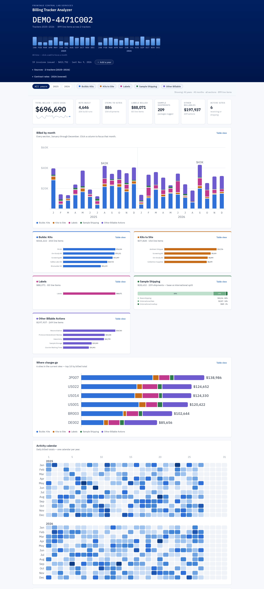

Each project's billing lived in a workbook with a tab per month, four tables inside each tab, and
a separate file for every year. Answering "what have we billed this client, ever?" meant opening
several files and adding things up by hand.

The page shows headline totals, a billed-over-time timeline, per-section and per-site breakdowns, an activity
calendar per year, the largest line items, and a searchable ledger of every charge. Filter by
month, by year, or by section and everything scopes to the selection.

Like the [label maker](/projects/label-maker/), it's one self-contained
HTML file that runs offline. Nothing is uploaded.

## Parsing a spreadsheet a human maintains

A workbook that people edit every month is not a data format.
It's a negotiation, and most of the work is refusing to trust it.

**Find tables by definition, match columns by name.** Rather than reading fixed cell ranges, it
locates each month's four tables by their Excel table definitions and then matches columns by
their *header text*. Projects with extra or reordered columns parse correctly without a code
change. Indexing by column position on a human-maintained file is a bug with a delay on it.

**Detect the totals people type in.** Sheets are full of hand-written subtotal rows: a
`January Total` here, a SUM row there, a dollar recap in the margin. Add those to the real line
items and every number is silently inflated. They're detected and excluded from every total,
while staying visible in a data-quality panel with an "include anyway" toggle, because the right
move is to show the user what you ignored rather than to quietly drop rows.

**Handle the categories that aren't categories.** Labels aren't a separate table. They're line
items living *inside* two other tables, identified by the word "label" or a packet-code prefix.
They get pulled into their own section for reporting while keeping a reference to the table they
came from, so the sheet's own SUM rows still reconcile and the year total doesn't move. The
prefix-based matches are heuristic, so they're flagged as **assumed** in the ledger and the
data-quality panel, so someone can spot-check exactly the rows the computer guessed at.

**Supersede rather than accumulate.** Load a revised copy of a year and it replaces the older one
automatically, so totals never double-count. Both stay listed, and you can reactivate the older
copy.

> Indexing by column position on a human-maintained file is a bug with a delay on it.

## Structure

The engine (parse, normalize, aggregate) and the chart layer (data → SVG strings) are both
pure, with no DOM anywhere in either. That's what makes them testable with zero installed
dependencies, and it's why the charts are hand-built SVG rather than a charting library: the
output is a string, and a string is easy to assert against.

`build/` holds the real source; the shipped `.html` is a generated artifact with the vendored
parser and the fonts base64-embedded. The footer stamps a version and build date, so a copy
someone saved months ago can identify itself.
