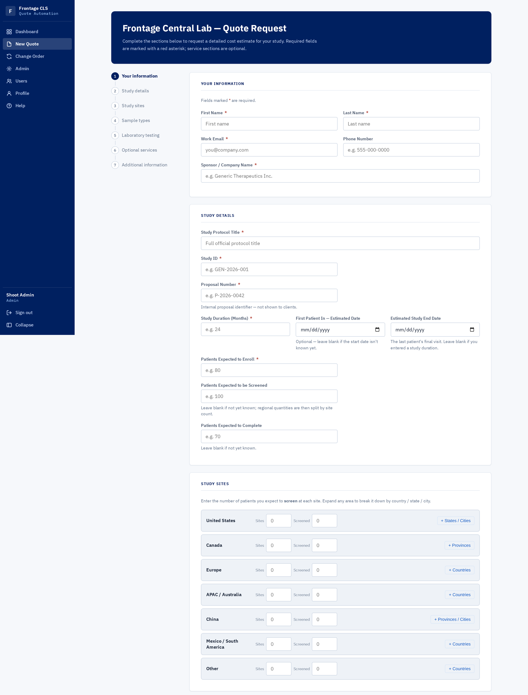
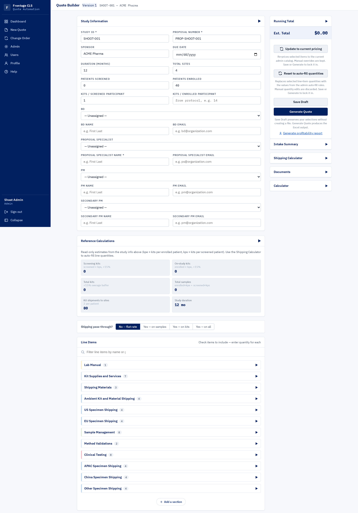
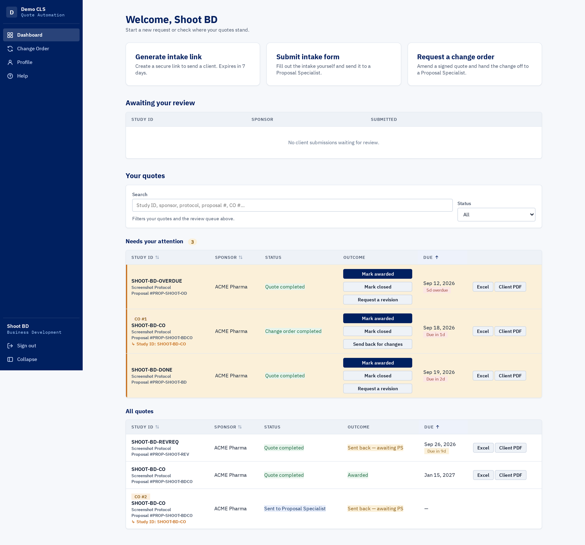
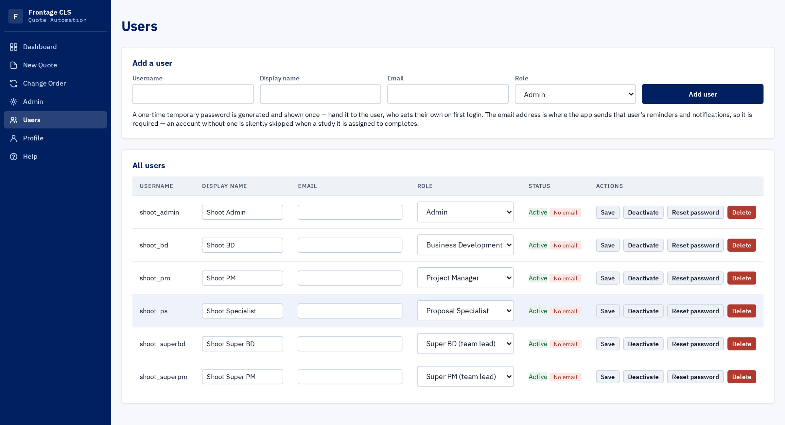

A contract research lab quotes a clinical study before it wins it. Getting to a quote meant a
business development lead extracting the specifics from the client over email. How many sites,
in which countries, which assays, what gets collected and shipped and stored, what isn't needed
at all. I was told those threads ran **twenty to thirty-five messages**, and I saw plenty of them.

Then that thread got handed to a proposal specialist, who built a pricing workbook from it by
hand. **About a day and a half per quote.** The team was trying to write thirty a month and
couldn't get there.

The failure I kept watching wasn't that the handoff was slow. It was that the handoff was
*incomplete*. Something would be missing: a country's site count, whether a sample type was
frozen or ambient. The only place that answer existed was somewhere in a thread the
specialist couldn't search and hadn't been part of. So the extraction started over.

By the end of the summer, specialists reported that the workload had dropped substantially.
Nobody measured it, so there is no number here.

## A thread is not a data structure

The client now fills in the intake themselves, through a single-use link that expires after a
week. Seven sections, and it can't be submitted half-finished. It lands on the business
development lead's dashboard, who reviews it, fills in the internal fields the client never
sees, and releases it to a specialist.

> The failure was not that the handoff was slow. It was that the handoff was incomplete.

What the specialist opens is not a summary of a conversation. It's a **draft quote**. The line
items the study needs are already selected, quantities are already derived, and the kit
and shipping maths is already done. Their job is to check a document and make the calls that need
judgment. Assembling one is no longer part of the job.

The Excel generator underneath all this was done in the first few days. Everything that took the
rest of the summer was the part nobody thinks about when they hear "it makes a spreadsheet."

## Custody: who holds the quote

A quote passes through several people who don't sit together, and in the old process nothing
owned it. So the system's real job is **custody**: at every moment, one clear answer to who
holds this, what they can change, and what happens when they let go.

**Opening the builder is a handoff, not a page load.** One write claims the quote, flips the
business lead's dashboard to "drafting in progress", and closes the lead's ability to keep editing
the intake underneath them. The claim and the signal are the same event, so they cannot disagree,
and the check runs inside the transaction, so a lead who saves at the same instant loses cleanly.

**Sending work back is two different things, deliberately.** Before a client signs, a revision
request *flags* the quote and the specialist decides when to reopen it. After a client signs, a
change order is a *direct push* into the drafting queue that leaves the existing draft untouched.
Separate fields, so the two can never entangle; the only difference between them is whether a
client has signed.

**One function answers whose desk it is on.** The attention queue, the row highlighting, the
"waiting on you" filter and the reminder digest all read that one answer, so they agree by
construction.

An award freezes the quote. What was sold is snapshotted once, every route that could modify it
refuses, and amendments go through change orders that baseline against exactly what was signed.

## Building the customer a seat, not a page

I was an intern with an end date. Anything I hardcoded would need an engineer to change after I
left, and there was not going to be an engineer.

So the admin surface is not a settings page. It is a whole role. An administrator can edit the
catalogue and its pricing, change **which line items auto-select and the arithmetic that fills
their quantities** through a visual editor with no formula typing, change what the intake form
asks, edit the legal footnotes, and manage users and roles. None of it requires a deploy, a
migration, or me. It is the part that got used: the people who ran quoting worked in that
console directly.

Storing behaviour as data has a cost: a wrong rule is harder to debug than wrong code. The
compensating move is that the editor can only build rules the system will accept. A variable that
cannot be known yet is refused with a sentence saying why, rather than saved as a rule that would
silently never fire.

## How it was built

**No frontend framework, no build step, no CDN.** For most of the project the application was
destined for an internal Windows VM I did not control, where every dependency was a request into
someone else's queue. So it needed almost nothing installed, and the JavaScript carrying real
logic sits in modules with no DOM access, unit-tested directly. That paid off unplanned: when a
Linux server arrived instead, the whole application was ported and production stood up in the
**last week of the internship**.

Most of the code was written by AI agents working from plans I wrote. One agent became several
on separate tickets, with another agent doing the rebasing, and that was the wrong answer. Agents
pushing to a shared branch thrash: whoever lands first moves the target, so everyone else is
instantly stale. That is a livelock, a serialisation problem, and a better model does not fix a
livelock. The fix was continuous integration and a merge queue, with **one command running the
whole gate** so CI and a person share a single definition of green. After that, five or six
agents at once was safe. Over eight weeks: **537 commits, 324 pull requests, 155 merged, and
1,691 tests**, a suite larger than the application.

> A better model does not fix a livelock. It just runs an expensive one.

The rest of that harness, and the four rules it grew from, are on the [process page](/process/).
